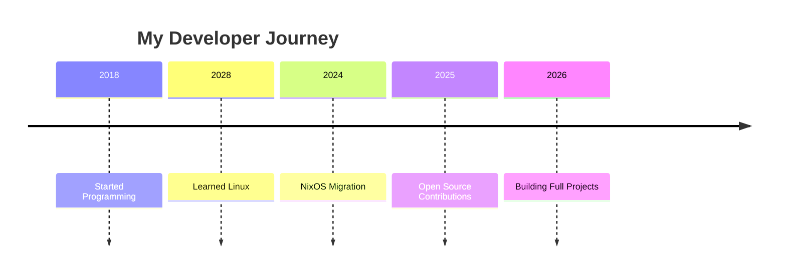

<!-- ========================================================= -->
<!--                GITHUB PROFILE LANDING PAGE               -->
<!-- ========================================================= -->

<div align="center">

# Hello, I'm autoUnmask


<br>

<a href="https://github.com/autoUnmask">
    
</a>

<a href="https://github.com/autoUnmask">
    
</a>

<a href="mailto:richardoluoch2015@outlook.com">
    
</a>

</div>

---

##  About Me

```text
┌──────────────────────────────────────────┐
│ OS       : NixOS                         │
│ Editor   : Neovim                        │
│ Shell    : Fish                          │
│ WM       : Hyprland                      │
│ Stack    : C • Java • PHP • JS • Linux   │
│ Status   : Building cool things          │
└──────────────────────────────────────────┘
```

I enjoy building software, automating workflows, customizing Linux environments,
and exploring open-source technologies.

---

##  Current Focus

<table>
<tr>
<td width="50%">

###  Learning

- Advanced Nix & Flakes
- Linux System Engineering
- Software Architecture
- Backend Development

</td>

<td width="50%">

###  Working On

- Attendance Management System
- Bus Tracking System
- Neovim Configuration
- Open Source Projects
- NixOS Configs

</td>
</tr>
</table>

---

##  Tech Stack

### Languages

<p>

</p>

### Development

<p>

</p>

### Systems

<p>

</p>

---

##  GitHub Analytics

<div align="center">

<picture>
  <source
    srcset="https://github-readme-stats.vercel.app/api?username=autoUnmask&show_icons=true&theme=tokyonight"
    media="(prefers-color-scheme: dark)"
  />
  <source
    srcset="https://github-readme-stats.vercel.app/api?username=autoUnmask&show_icons=true&theme=gruvbox"
    media="(prefers-color-scheme: light)"
  />
  
</picture>

<picture>
  <source
    srcset="https://github-readme-stats.vercel.app/api/top-langs/?username=autoUnmask&layout=compact&theme=tokyonight"
    media="(prefers-color-scheme: dark)"
  />
  <source
    srcset="https://github-readme-stats.vercel.app/api/top-langs/?username=autoUnmask&layout=compact&theme=gruvbox"
    media="(prefers-color-scheme: light)"
  />
  
</picture>

</div>

---

##  Contribution Activity

<div align="center">

<picture>
  <source
    srcset="https://github-readme-streak-stats.herokuapp.com/?user=autoUnmask&theme=tokyonight"
    media="(prefers-color-scheme: dark)"
  />
  <source
    srcset="https://github-readme-streak-stats.herokuapp.com/?user=autoUnmask&theme=gruvbox-light"
    media="(prefers-color-scheme: light)"
  />
  
</picture>

</div>

---

##  Open Source Journey



---

<details>
<summary><b> Featured Projects</b></summary>

<br>

| Project | Description |
|----------|------------|
|  Bus Tracking System | Real-time SACCO tracking |
|  Attendance System | Student attendance platform |
|  NixOS Config | Fully declarative setup |
|  Neovim Config | Modern Lua-based workflow |

</details>

---

<details>
<summary><b> Developer Philosophy</b></summary>

<br>

> Build things that solve real problems.
>
> Keep systems simple.
>
> Automate repetitive work.
>
> Learn continuously.

</details>

---

## Connect

<div align="center">

<a href="https://github.com/autoUnmask">

</a>

<a href="https://linkedin.com/in/#">

</a>

<a href="mailto:richardoluoch2015@outlook.com">

</a>

</div>

---

<div align="center">

### 🦊 Gruvbox Light ☀️ • Kanagawa Dark 🌙


</div>
