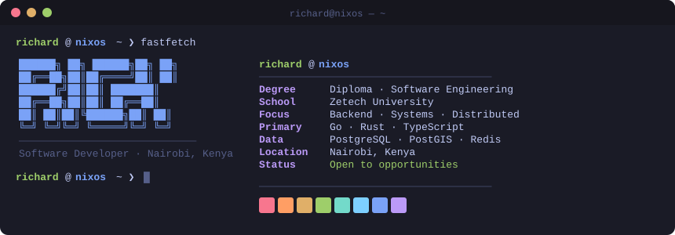

<div align="center">
  
</div>

<br>

```
❯ cat about.txt
```

Software developer focused on backend systems, distributed applications, and systems programming.
I build things that are reliable, practical, and grounded in real use cases — currently with a
particular interest in geospatial backends and Go service architecture.

Completing a **Diploma in Software Engineering** at Zetech University. Open to opportunities.

---

```
❯ ls -la ./projects/
```

<br>

### Bus-tracking

Real-time public transport system with geospatial vehicle tracking and seat reservation, built for Nairobi's transit context. The core challenge was cleanly separating the tracking and reservation domains while keeping both reactive to live data.

```
Go · React · PostgreSQL · PostGIS · Redis/Valkey · Docker
```

[github.com/autoUnmask/Bus-tracking](https://github.com/autoUnmask/Bus-tracking)

<br>

### hash-verification-checker

CLI utility for verifying file integrity via cryptographic checksums. Detects tampering or corruption by comparing computed hashes against known-good values.

```
Python
```

[github.com/autoUnmask/hash-verification-checker](https://github.com/autoUnmask/hash-verification-checker)

<br>

### Password-Vault

Local credential manager with secure storage and retrieval. Built around encryption-at-rest for stored passwords with a clean CLI interface.

```
Python
```

[github.com/autoUnmask/Password-Vault](https://github.com/autoUnmask/Password-Vault)

<br>

### CBC-portal-For-Schools

Web portal for managing school records within Kenya's Competency Based Curriculum framework. My first substantial project — a PHP/MySQL application that handles student data, grading, and reporting across school departments.

```
PHP · MySQL
```

[github.com/autoUnmask/CBC-portal-For-Schools](https://github.com/autoUnmask/CBC-portal-For-Schools)

---

```
❯ cat stack.conf
```

```toml
[languages]
primary = ["Go", "TypeScript", "Rust", "C++"]

[web]
runtime    = ["Node.js"]
frontend   = ["React", "Tailwind CSS"]

[data]
databases  = ["PostgreSQL", "Redis"]
extensions = ["PostGIS"]

[tooling]
containers = ["Docker"]
vcs        = ["Git"]
```

---

```
❯ gh stats autoUnmask
```

<div align="center">
  <picture>
    <source
      media="(prefers-color-scheme: dark)"
      srcset="https://github-readme-stats.vercel.app/api?username=autoUnmask&show_icons=true&hide_border=true&rank_icon=github&bg_color=1a1b26&title_color=7aa2f7&icon_color=bb9af7&text_color=c0caf5"
    />
    <source
      media="(prefers-color-scheme: light)"
      srcset="https://github-readme-stats.vercel.app/api?username=autoUnmask&show_icons=true&hide_border=true&rank_icon=github&bg_color=e1e2e7&title_color=2e7de9&icon_color=9854f1&text_color=3760bf"
    />
    
  </picture>
  &nbsp;
  <picture>
    <source
      media="(prefers-color-scheme: dark)"
      srcset="https://github-readme-stats.vercel.app/api/top-langs/?username=autoUnmask&layout=compact&hide_border=true&bg_color=1a1b26&title_color=7aa2f7&text_color=c0caf5"
    />
    <source
      media="(prefers-color-scheme: light)"
      srcset="https://github-readme-stats.vercel.app/api/top-langs/?username=autoUnmask&layout=compact&hide_border=true&bg_color=e1e2e7&title_color=2e7de9&text_color=3760bf"
    />
    
  </picture>
</div>

---

```
❯ cat contact.txt
```

```
GitHub  →  github.com/autoUnmask
Email   →  richardoluoch2015@outlook.com
```
